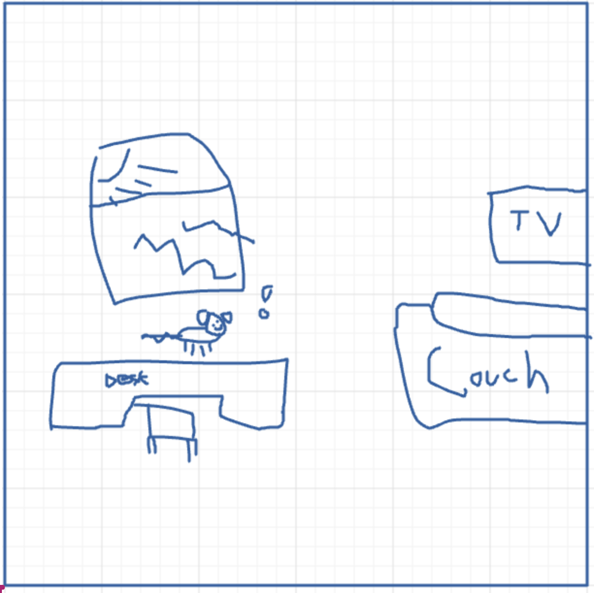
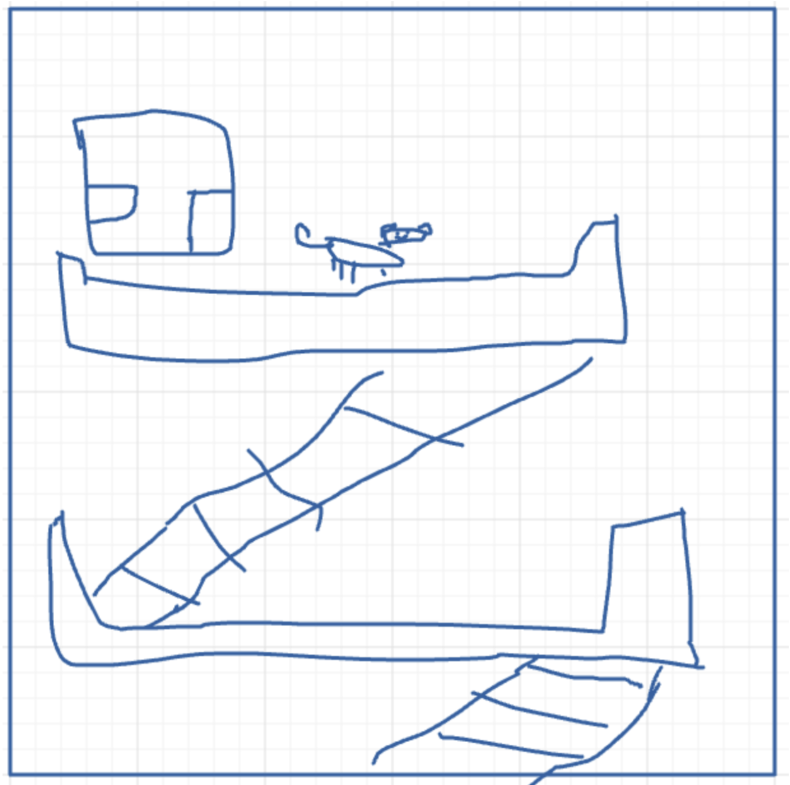
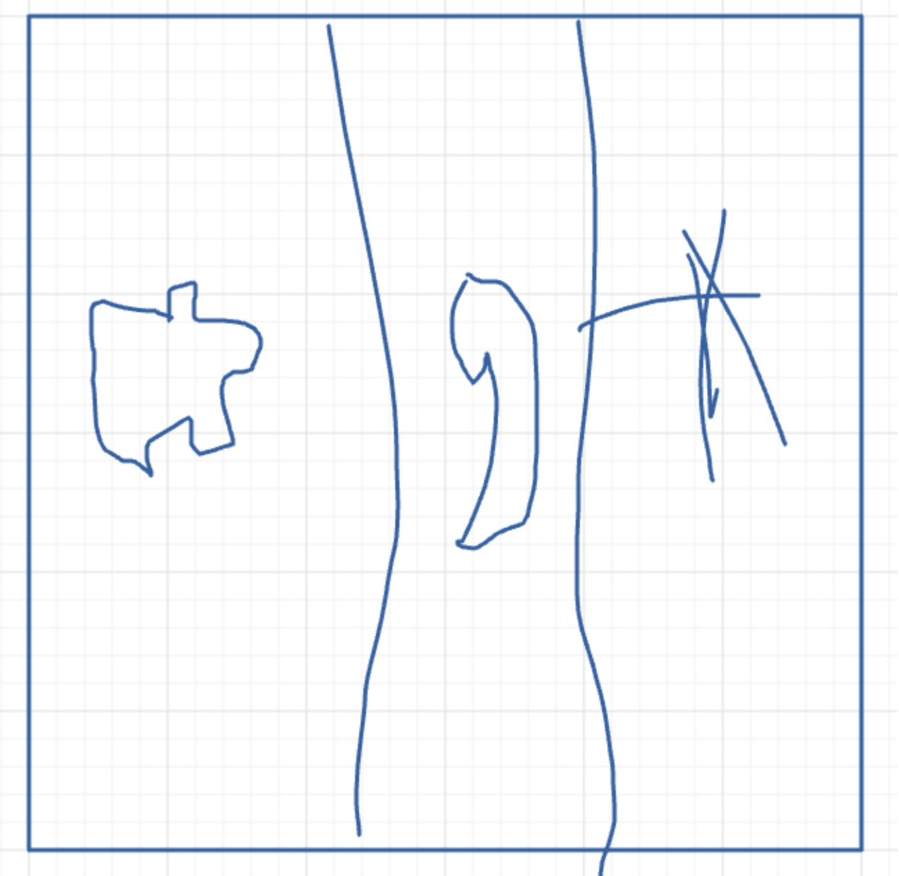
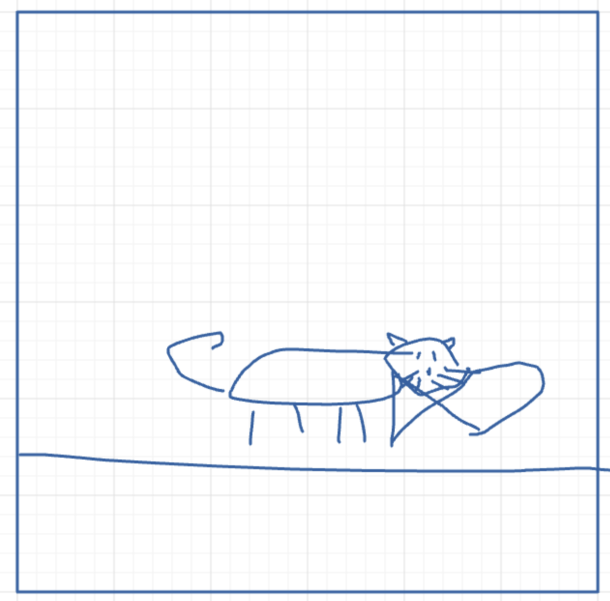

# Game Name

Data Paws

## Elevator Pitch

*We’re combining elements of traditional platformers with puzzles inspired by Python Data Structures to make Data Paws, a game where you explore the city through the lens of a cat. The game teaches the player all about different data structures in a fun and entertaining format, suitable for even the most inexperienced people.*

## Influences (Brief)

- *Influence #1: The Secret Life of Pets*
  - Medium: *Movie*
  - Explanation: *This movie is an inspiration in the sense that the main dog character sneaks out of the house when the owner is away. The dog then can meet other pets, animals, and situations similar to scenes in the movie.*
- *Influence #2: Indie Pixel Art Aesthetic*
  - Medium: *Game*
  - Explanation: *For the game, we're going for that indie pixel art style, similar to games like stardew valley or undertale. We want the game to feel calming while still being enticing enough for the player to focus and learn.*
- *Influence #3: Stray*
  - Medium: *Game*
  - Explanation: *The game Stray is about a cat who needs to explore and complete puzzles. We want to incorporate this concept into our game to achieve the same effect in a 2D manner.*

## Core Gameplay Mechanics (Brief)

- *Screen-To-Screen Gameplay*
- *Environmental Interactions with NPCs and Items*
- *Platforming Actions*
- *Solving Puzzles*

# Learning Aspects

## Learning Domains

*Data Structures*

## Target Audiences

*Our games target audience will be focused towards younger people who are taking an interest in the computer science pathway, particularly early middle school to early high school. Of course, however, the game can be played by anyone*

## Target Contexts

*Our game can be used in early computer science learners' classrooms to teach about data structures, as extra credit for beating it, and for people who like chill puzzle platformers.*

## Learning Objective

- *Understand Basic Data Structures*: *By the end of the instructions, younger students should be able to identify and explain the fundamental concepts of key data structures—such as Stacks, Queues, Linked Lists, and Hash Tables—through an engaging, puzzle-based learning experience.*

## Prerequisite Knowledge

- *Prerequisite Learning Objective #1: Basic Python Proficiency - Data structure puzzles will be using Python syntax.*
- *Prerequisite Learning Objective #2: 2D Platforming experience - Have some experience playing a 2D platformer game. Examples: (Mario, Sonic, Hallow Knight)*
- *Prerequisite Learning Objective #3: Basic Problem Solving Skills - Need to be able to use observational skills to solve puzzles that don’t have clear solutions.*

## Assessment Measures

*Metrics: Time, Game Completeness, Final Highscore, NPC Quizzes*

# What sets this project apart?

* This game is different in the sense that we are making the game chocolate-covered strawberries instead of chocolate-covered broccoli. We want this game to pass as an educational game, but at the same time, be a fun game that can keep players hooked on playing. Plus, there are cute animals which are a draw to all players.*

# Player Interaction Patterns and Modes

## Player Interaction Pattern

* This game is played as a platformer in singleplayer where the player explores the cityscape and interacts with NPCs while solving puzzles that fit well into the narrative.*

## Player Modes

*Your game has one or more player modes. Describe each discrete mode, considering things like menus too. Generally describe the transitions between modes too.*

- *Singleplayer*: *You complete puzzles to progress through each stage, and reach the end of the game.*

# Gameplay Objectives

- *Primary Objective #1*:
    - Description: *Reaching the end of the game (Gets the fish)*
    - Alignment: *This relates to our learning objective because the player has to complete all the puzzles in the game*
- *Primary Objective #2*:
    - Description: *Get the highest score possible (S)*
    - Alignment: *Shows mastery of learning data structures and the players understanding of the mechanics*

# Procedures/Actions

*The player can move left/right, jump, drop, crawl, sprint, and interact.*

# Rules

*The player is able to use hints given in game as well as any external resources they want to. If they cheat, it's their loss for not learning properly. There will be a lot of things in the game to guide the player, so there shouldn't be any reason to tin the first place. However, there are only a certain amount of hints the player gets, but not enough to get overwhelmed.*

# Objects/Entities

*Player (i.e. Cat or Dog) / Platforms that you would see in a cityscape / Obstacles such as trash bins, ladders, and water pipes / NPCs and Enemies / Collectables / The Puzzles Themselves.*

## Core Gameplay Mechanics (Detailed)

- *Screen-To-Screen Gameplay - Puzzles are split up into individual screens, you can’t progress to the next screen until you finish the current puzzle but you can always go backwards. This is to keep the player’s focus on the current puzzle, they should be able to solve each puzzle given the resources on the current screen.*
- *Environment: The environment in Data Paws is going to be a cityscape with NPCs (other pets and animals), which the player is able to talk to and complete tasks for and then you can get a hint for a tricky puzzle. The background music will be lofi beats and the sounds will be satisfying.*
- *Platforming/Animation of the cat - Animated movement of the cat when sprinting, crawling, climbing, jumping, and playing with environment objects.*
- *Puzzles: The game needs to incorporate different puzzles throughout the different levels. The levels should be incorporated into the level and shouldn't feel forcibly placed. In other words, the puzzle should progress the story while still being educational to the user. The puzzles will relate to a corresponding data structure. For example, at one level the player may need to complete a puzzle that represents a list/linked list. The puzzle should be disguised into the level (chocolate covered broccoli, in a way).*

    
## Feedback

*There will be sounds and animations for the cat for when you get something wrong or right. We want to have a Scribblenauts type of scene where the camera pans to the “exit” or “solution”, and then back to the cat so it clearly shows that the level is completed. For long-term progression, a constant letter score will be on screen calculated using the amount of time taken and how the puzzles were completed.*

# Story and Gameplay

## Presentation of Rules

*The movement mechanics will be shown during the tutorial level through graffiti on the wall. Other mechanics such as avoiding enemies will be through trial and error learning. The beginning puzzle at the end of the tutorial level will be easier than the others because we will give more hints. Popups will appear next to interactables.*

## Presentation of Content

*We are teaching the core material through the progression of the game, which includes puzzles about data structures that are mixed into the narrative and the environment.*

## Story (Brief)

*The player, who is a cat, is at the window of their owners city apartment and smells an aroma cartoon-style. The cat cannot resist the temptation so they go down the fire escape, and the cat has to wade through various levels set in a cityscape while avoiding good-hearted humans who want to return the cat back home, interacting with fellow pets and strays, and finally reaching the promised delectable fishy treat at the end.*

## Storyboarding

Opening cut-scene (Cat smelling aroma from window)

Cat going down fire escape (Movement Tutorial)

![Cat doing stack puzzle (first in last out) [Puzzle Tutorial]](readme_images/image3.png)
Cat doing stack puzzle (first in last out) [Puzzle Tutorial]

3 Puzzles (TBD)

Cat eating fish (tentative ending)

# Assets Needed

## Aesthetics

*The game is going to be done in a pixel art style. The goal is to try and achieve that feeling of indie game pixel, kind of like stardew valley. We also want it to kind of play out like game Stray, but more in a 2D platformer environment like Mario*

## Graphical

- Characters List
  - *Player (Cat)*
  - *Owner*
  - *NPCs*
  - *Enemies*
- Textures:
  - *City Backdrop*
  - *Tileable platform objects*
  - *Background objects*
  - *Text and fonts*
- Environment Art/Textures:
  - *Buildings*
  - *Sidewalks*
  - *Street*
  - *Other city environment objects*

## Audio

*Game region/phase/time are ways of designating a particularly important place in the game.*

- Music List (Ambient sound)
  - *Ambience lofi in the background*
  - *8 bit sounds relating to game actions as well*
  
*Game Interactions are things that trigger SFX, like character movement, hitting a spiky enemy, collecting a coin.*

- Sound List (SFX)
  - *Jumping*
  - *Success/fail meow*
  - *Damage*
  - *Incorrect Action*
  - *Coin collection*
  - *Interacting with objects*

# Metadata

* Template created by Austin Cory Bart <acbart@udel.edu>, Mark Sheriff, Alec Markarian, and Benjamin Stanley.
* Version 0.0.3
